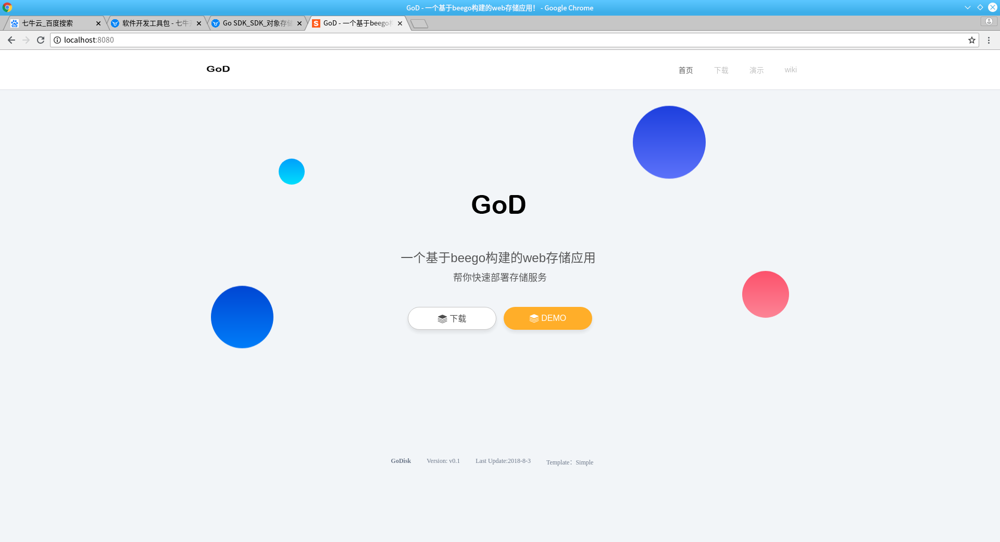
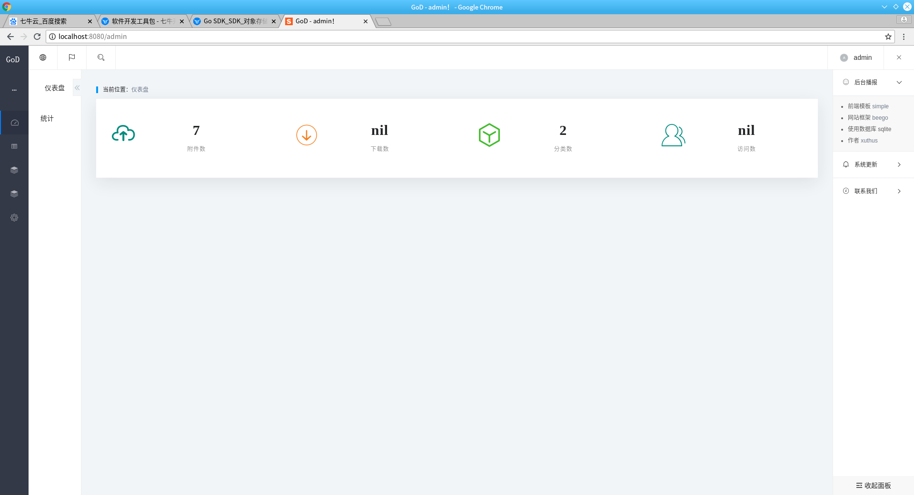
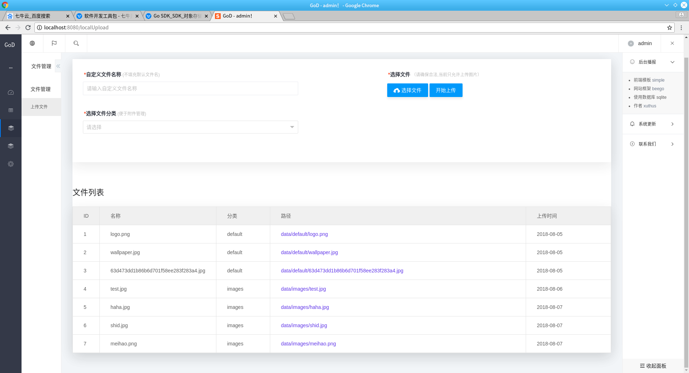
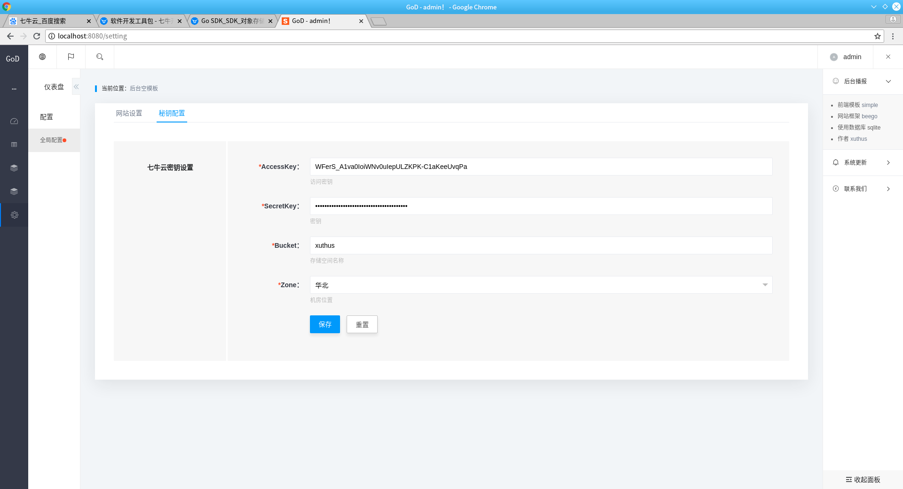

# GoD

> 一个基于beego构建的web存储应用，帮你快速部署存储服务

##  1. 如何使用这个服务

&ensp; 1. 首先，确认已经安装好golang语言环境

&ensp; 2. 执行一下命令，安装一些依赖包与框架(建议使用gopm进行包管理)

```bash
go get github.com/astaxie/beego
go get github.com/mattn/go-sqlite3
go get github.com/jmoiron/sqlx
go get -u github.com/qiniu/api.v7
```

假若无法使用以上命令，请单独下载source.zip资源包，直接解压放到 ```$GOPATH/``` 目录下即可，里面包含有所有的依赖

&ensp; 3. 启动项目

&ensp;&ensp; 进入项目 执行 go run main.go 即可启动项目

&ensp;&ensp;你也可以使用beego官方提供的 bee工具 来快速启动，你可以通过如下的方式安装 bee 工具，安装完毕后，进入项目 执行 ```bee run``` 即可快速启动

```bash
# 安装bee工具
go get github.com/beego/bee
```

&ensp;&ensp; 浏览器输入 http://ip:8080 访问

# 演示地址

[官网](http://xblogs.cn:8080)----------------[demo](http://xblogs.cn:8080/login)

# 演示截图






